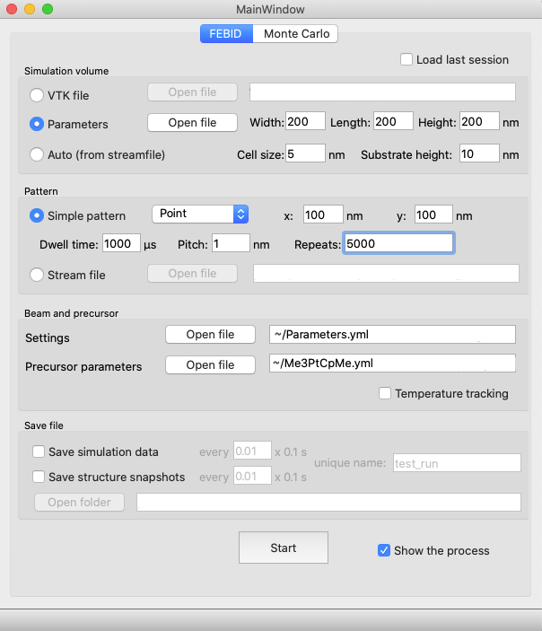

Getting started
================

Introduction
-------------
Simulation of the FEBID process written in Python.
FEBID stands for Focused Electron Beam Induced Deposition, a variation of a CVD (chemical vapor deposition) process.
It uses volatile organo-metallic molecules (precursor) as material and a controlled electron beam
to selectively deposit material on a substrate.

Simulation base features:

#. Continuum model
#. Enabled diffusion
#. Enabled temperature effects
#. Electron-matter interaction via Monte Carlo simulation
#. No gas dynamics implications

Installation
---------------
The simulation requires Python 3.7 or later.

For Windows installation, `Microsoft C++ Build tools <https://visualstudio.microsoft.com/visual-cpp-build-tools/>`_
has to be installed.

Before getting to the installation of the package, a compiler has to be configured. The package contains *Cython*
modules with *OpenMP*, that are compiled during installation. For that *LLVM* is advised for installing:

On Macs: ``brew install llvm``

On Linux: ``sudo apt-get install llvm``

Next, there are two ways to install the package:

1. Clone the repository, choose virtual environment and install package locally with ``pip install .``
2. Alternatively, it can be installed from github via pip directly:

    ``pip install git+https://github.com/MrCheatak/FEBID_py.git#febid``

Running the first simulation
-----------------------------
In order to run the first simulation, *Paramenets.yml* and *Me3PtCpMe.yml* parameter files in the
`Examples <https://github.com/MrCheatak/FEBID_py/tree/master/Examples>`_ folder are needed.
As the installation finishes, run ``python -m febid``, which will show the main control panel:

There are three main setup steps that are essential for the simulation: space, pattern and parameters of the
beam and deposition material. Further instructions will configure a simulation on a 200x200 nm substrate
with a stationary 5s exposure of a 30keV 0.15nA beam deposition using the Me3PtCpMe precursor.

Space:
    Firstly, a simulation volume domain has to be created. The simplest case is a clean substrate.
    Choose *Parameters* option and specify 200x200x200 nm
    dimensions with 5 nm cell size and 10 nm substrate. This will define a cubic simulation domain divided into voxels
    with 5 nm edge length. Finally, a 20 nm layer of substrate material (Au) is laid at the bottom.

Pattern:
    Next, pattern has to be defined for the controlled beam. Choose *Simple patterns* and select *Point* from the drop-down
    menu. This option will fix the beam at a point specified by X and Y parameters, set both of them to 100 to position
    the beam at the center of the substrate. The time that the beam will spend at that point is defined by *dwell time*
    and *repeats* parameters. Lets set a 5 s exposure by setting them to 1000 and 5000 correspondingly.
    A beam is configured now to stay at the (100,100) point for 5 s.

Beam and precursor:
    Finally, open *Parameters.yml* for *Settings* and *Me3PtCpMe.yml* for *Precursor parameters*. The first one
    specifies the beam parameters and precursor flux, the second provides precursor material properties.

Lastly, uncheck all the saving options and enable *Show the process* to watch the growth in real
time and hit **Start**.

A new window is then shown with a scene containing the substrate. The scene can be rotated and zoomed to get a better
view angle.

.. important::

    Besides the graphical representation, a console is will display simulation info. It is important to keep an eye on it as
    the deposition progress, execution speed and warnings and errors, if any occur, are output to the console.
